<h1>KAIST SW 교육</h1>

<div align = center>
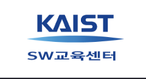
</div>
<br>

[2022] 전국 고등학생 대상 SW전공 진로탐색 및 교육 (11/12~13일)

<br>

# 11월 12일

### 제 1교시 

 - KAIST 전산학부의 '가치관' (류석영 교수)
  
 
 <h2>Human-Centric-Computing</h2>
<br>

>Computing Science
>
>System and Network
>
>Software Design
>
>Secure Computing
>
>Visual Computing
>
>AI
>
>Social Computing
>
>Interactive Computing


<h2>Q. 컴퓨터 코딩을 배워서 뭘 하나요?</h2>

- 전산학부는 문제를 해결하는 법을 배우는 곳입니다.
<br> (like  CS처럼)
```
문제해결 = 요리
코딩 = 칼질
```
❤️ A. 문제 해결!

* * *

### 제 2교시 
카이스트 자랑.
 - SW 멘토링
 - KAIST 활동 및 진로
 - KAIST에서 살아남기
 - Q&A

### 제 3교시
- 4차 산업혁명 시대의 빅데이터 종류와 활용 사례 (이재길 교수)
 
### 제 4교시
- 빅데이터 실습 (네이버 영화 리뷰 데이터 스크래핑 및 분석 실습)

### 제 5교시
- SW 전공생 특강 (KAIST 전산학부)


* * *
* * *

# 11월 13일

### 1교시

- AI 특강 및 실습

>Graphics AI
>
>Intelligent AI
>
>Vision AI
>
>AI Application
>
>Knowledge AI Recommedation
>
>Knowledge AI Flitering
>
>AI 개발 

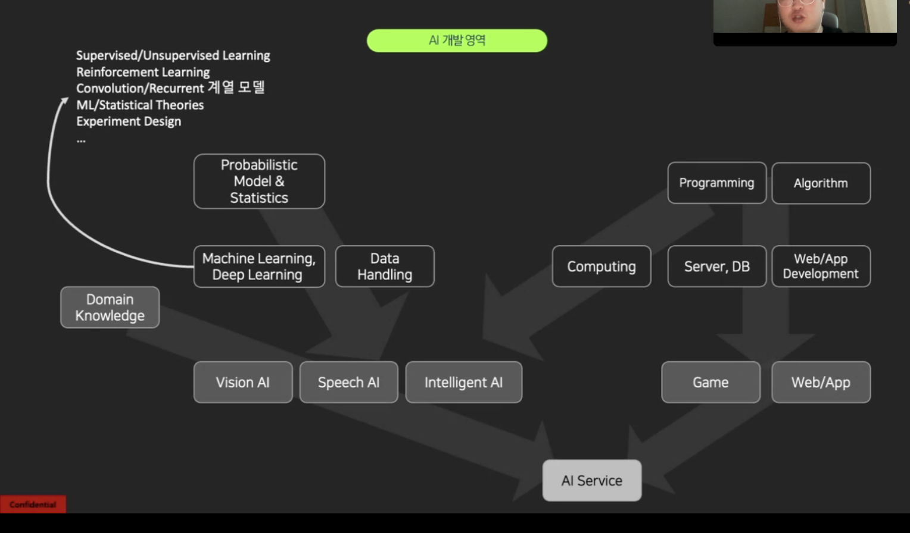

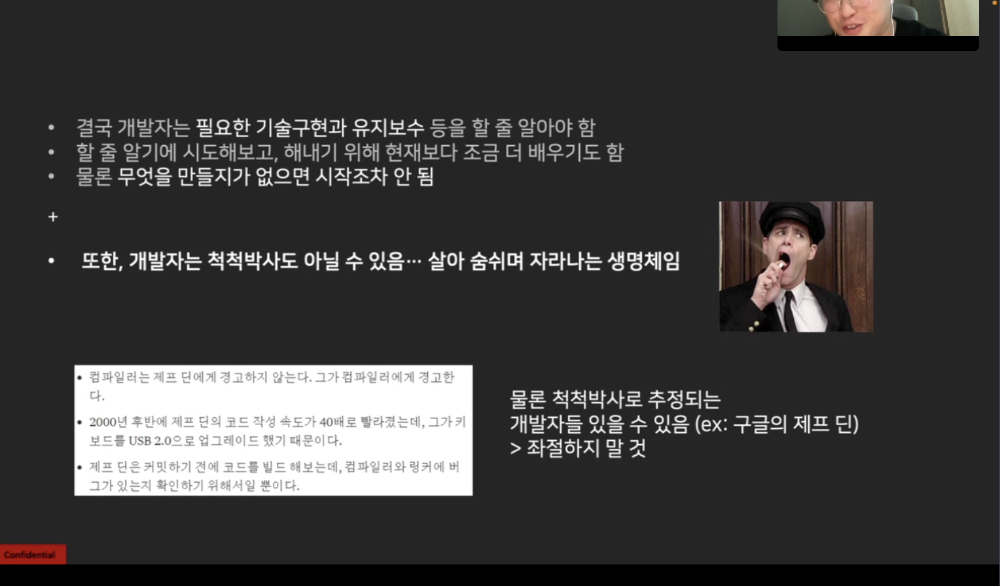
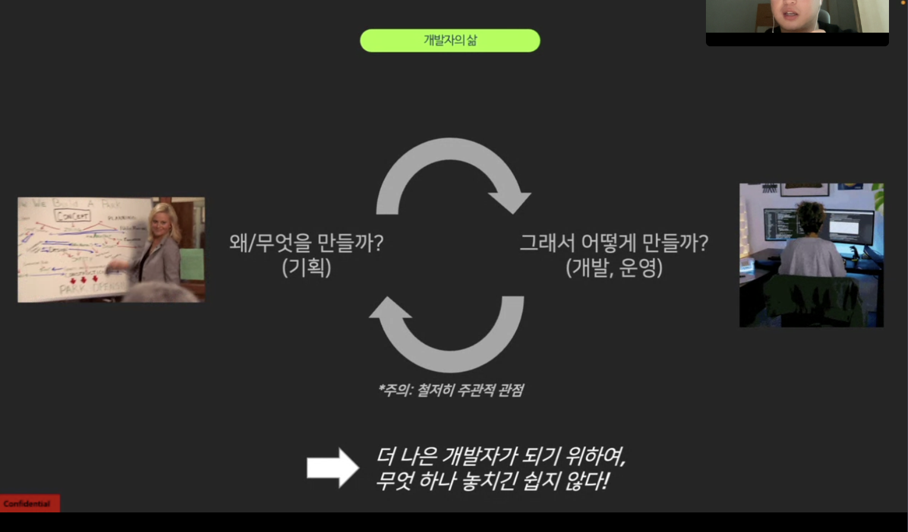
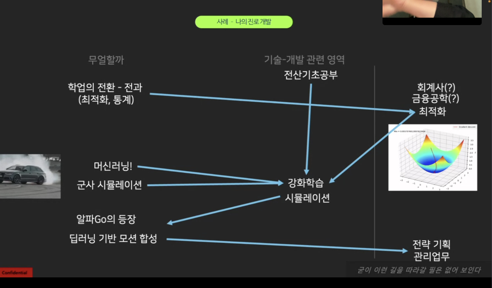

### 제 2교시

- 딥러닝 알고리즘
- 인공지능 실습 (소리 분석 앱 만들기)

<h2>딥러닝이란?</h2>

- 여러 비선형 변환기법의 조합을 통해 높은 수준의 추상화를 시도하는 기계학습 알고리즘의 집합
- 비선형 함수를 여러 층 쌓아서 만든 것

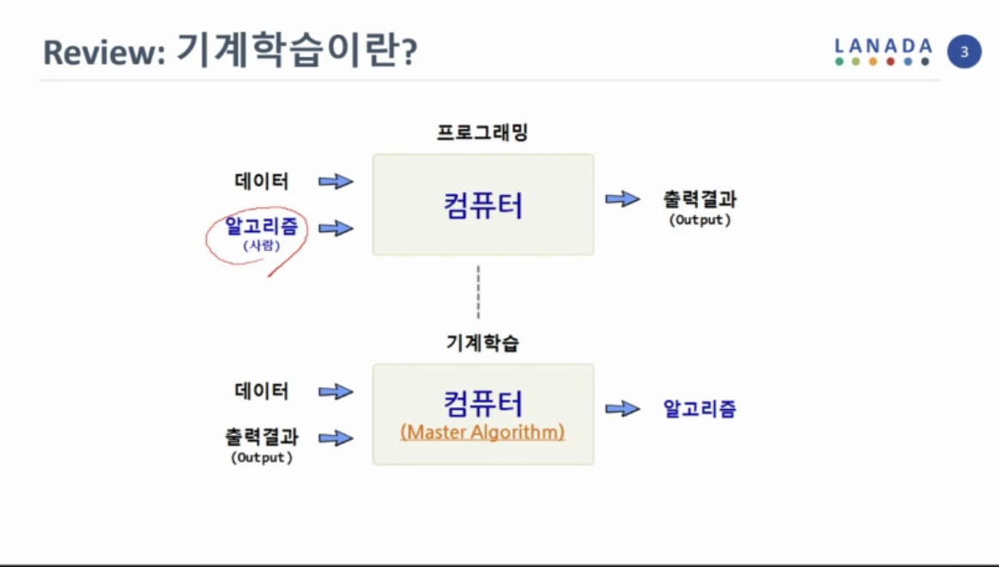
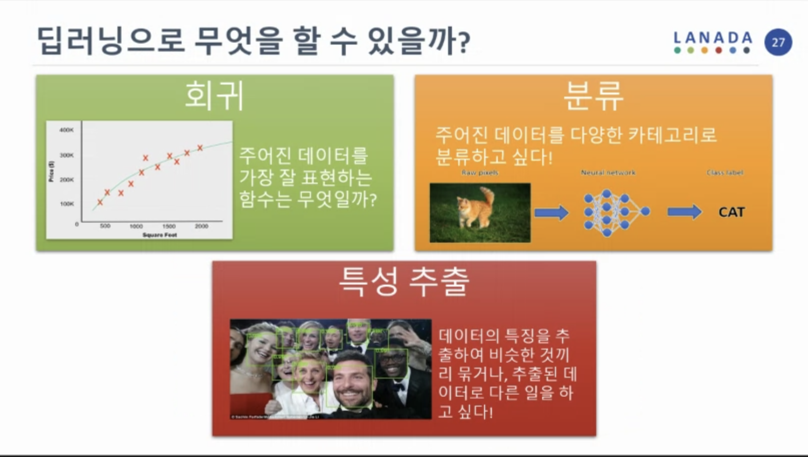

```
딥러닝으로 무엇을 할 수 있을끼? = 우리에게 필요한 함수를 만들어준다.
```
2층 신경망은 중간 층의 노드 개수가 충분할 때, 모든 함수를 근사할 수 있다.

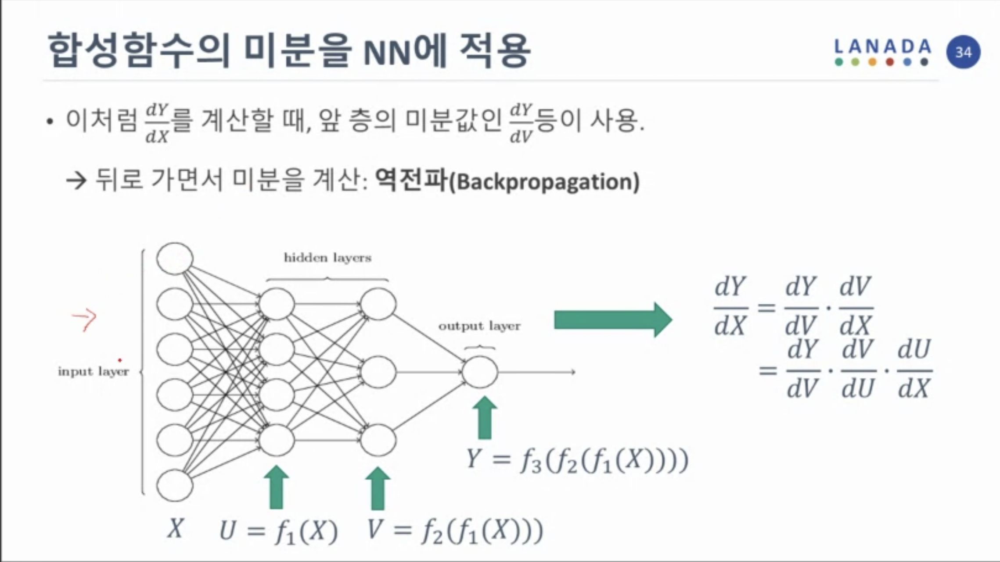
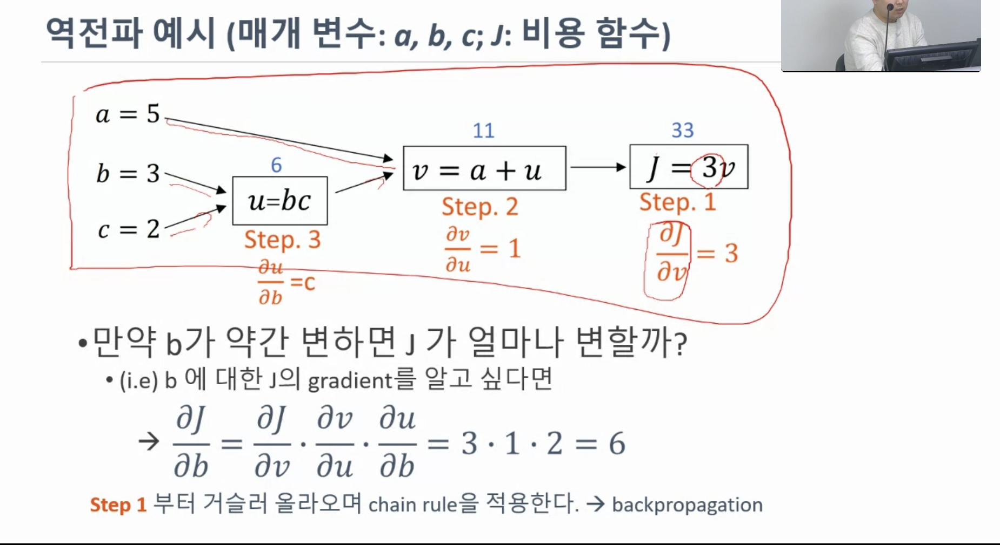

## 합성곱 신경망

- 계층적 특성 추출
- 패턴 인식

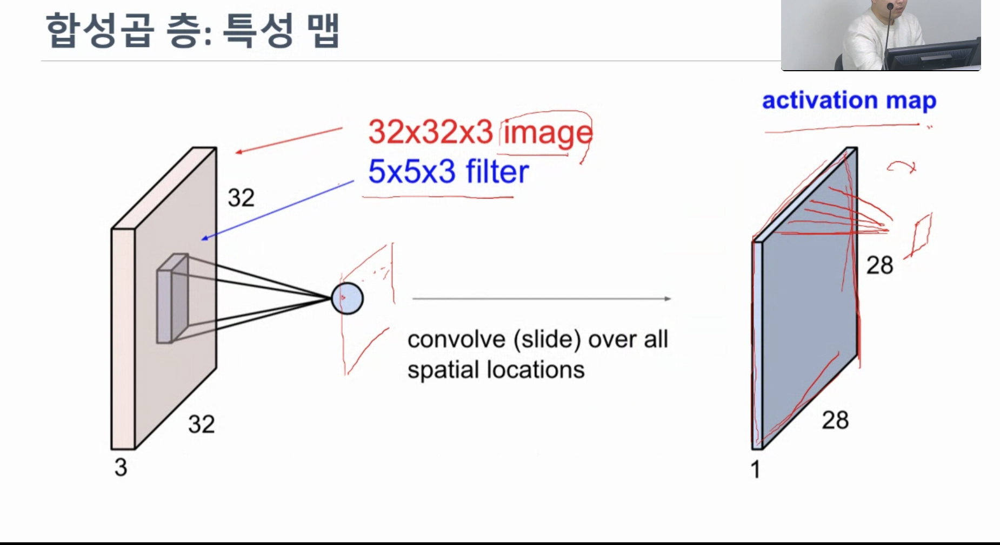
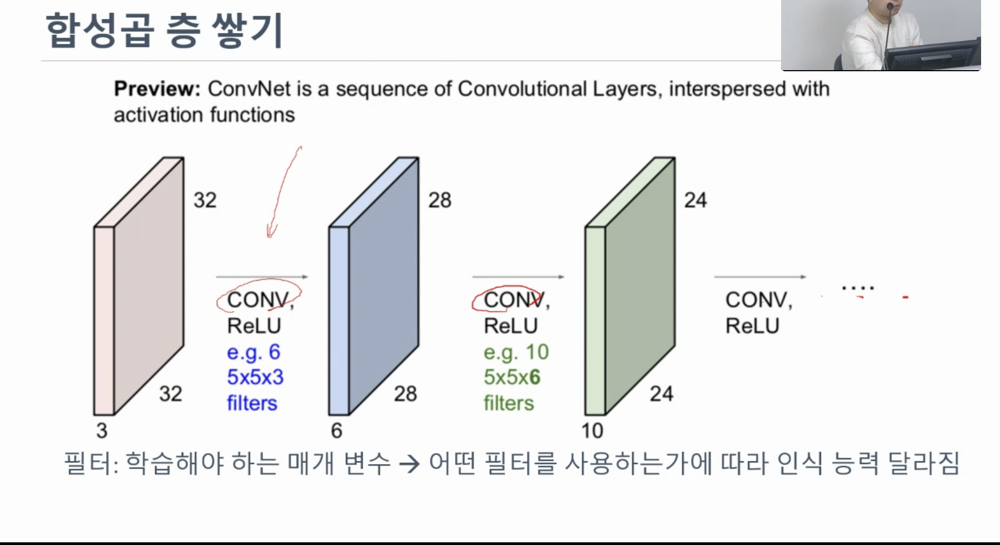

..mov 파일이 안 열리네요..
<br>

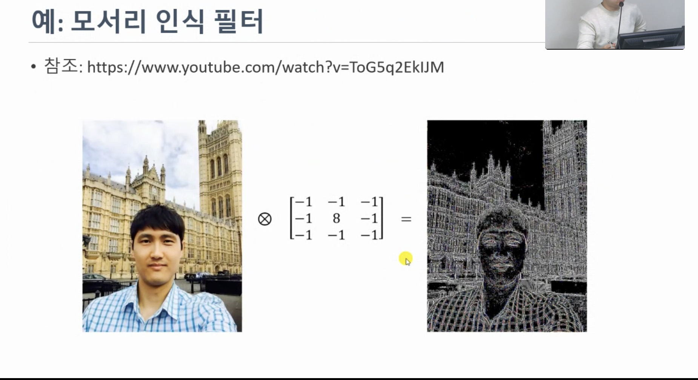

## 풀링(polling)이란?

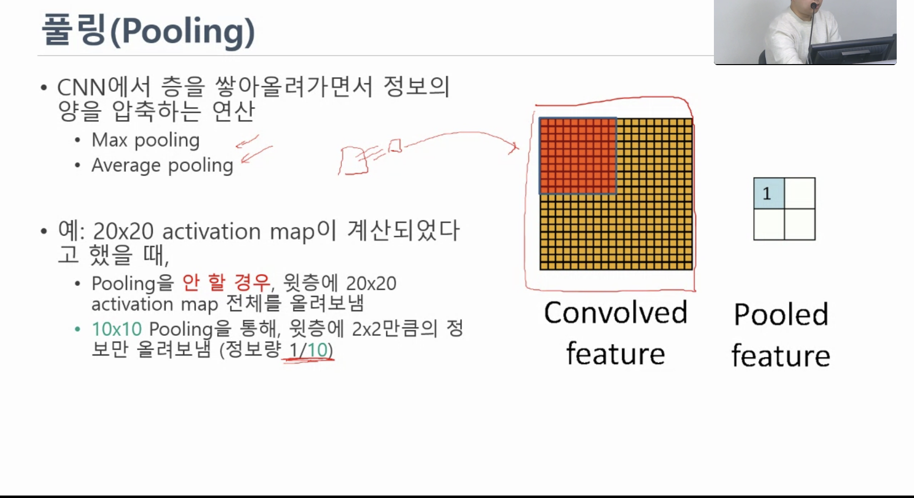

# CNN 전체 구조

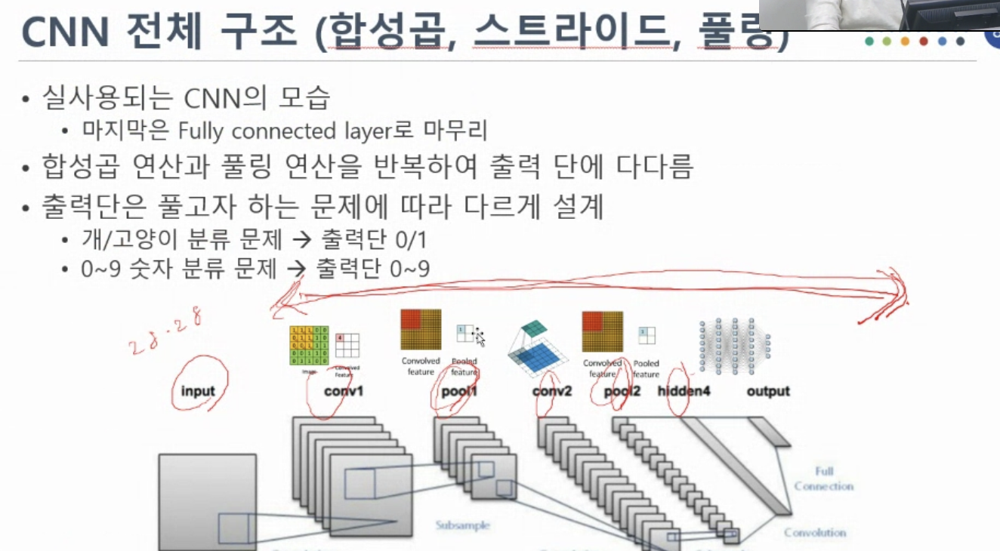

>1,2,3층 합성곱 신경망
>
>스트라이드
>
>풀링

# RNN

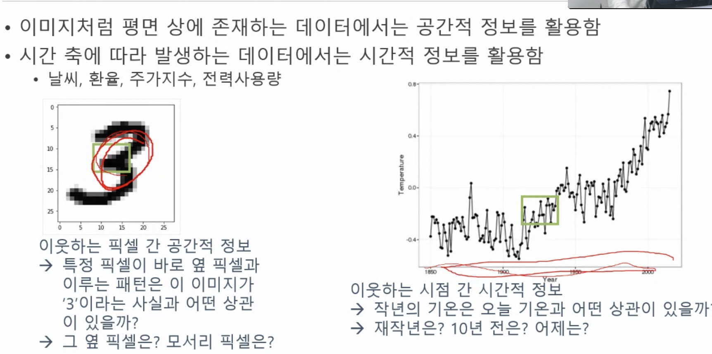

## 시계열 기반 문제 해결의 어려움

```
과거 데이터들 간 상대적 중요도 추정

과거 데이터 자체 또는 그들 간의 상관관계를 기억해야 함
```
## 순환 신경망 세포

- FC NN 또는 CNN에서는 현제 스텝의 입력값이 유일한 입력값임
- 반면, RNN의 한 "뉴런"은 현제 스텝의 입력값으로 받음.

### 순환의 의미

>바로 전 스텝의 출력값을 입력으로 받는 다는 것의 의미
>
>>이번 스텝의 연산(예측, 분류 등)을 위해 과거의 데이터를 참조하겠다.
>
>>이번 연산의 결과를 통해 계산된 매개 변수 업데이트 값을 시간축을 따라서도 역전파시키겠다.


# 시계열을 활용하는 예: RNN의 활용


# 순환 신경망 

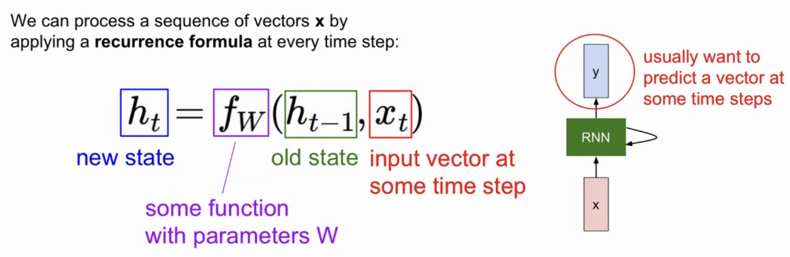

- 모든 time-step에서 같은 매개 변수를 가지는 같은 함수를 사용한다.
- ht는 기존 신경망의 중간 층 같은 개념
- 다른 점은 시간적으로 앞뒤로 연결이 되어 있다는 것

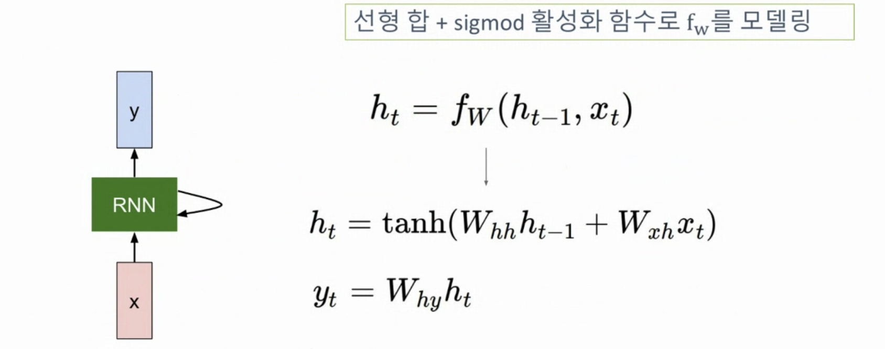

