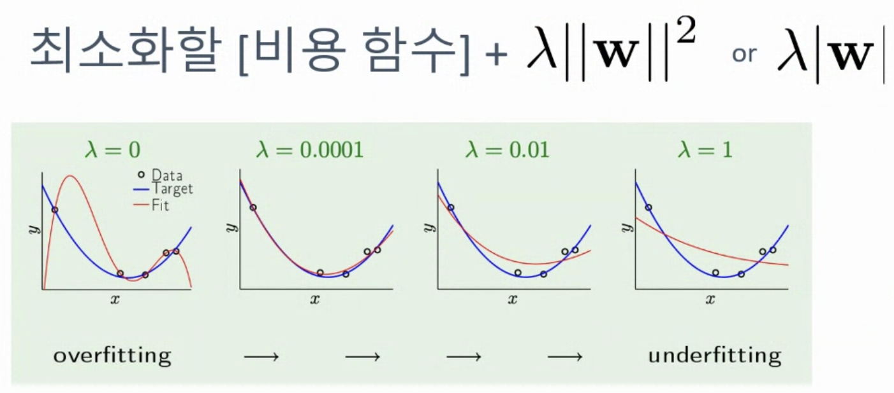
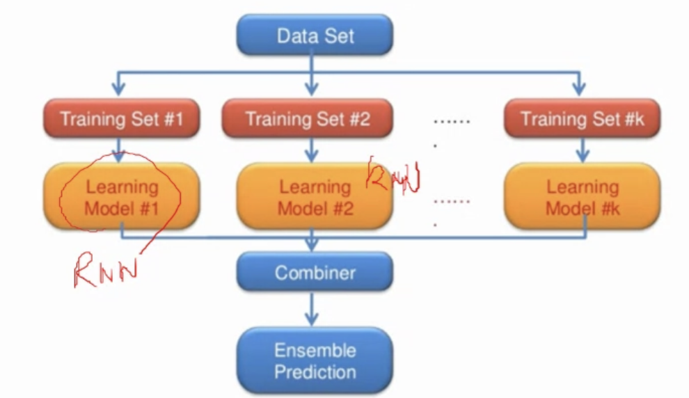
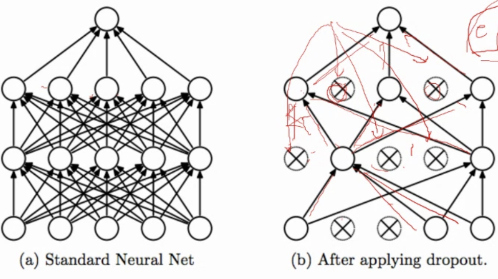
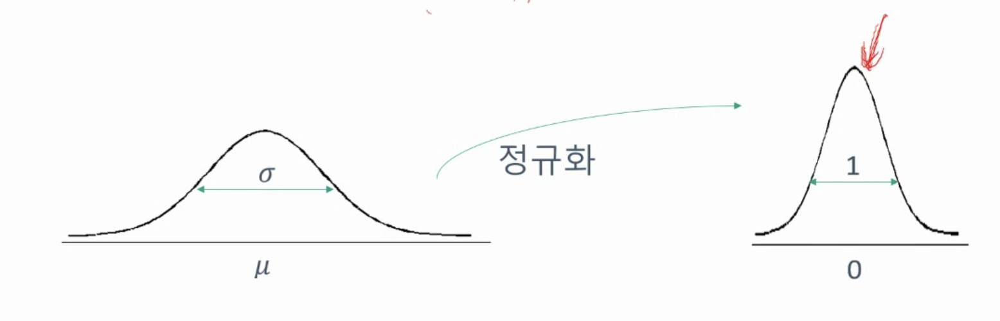
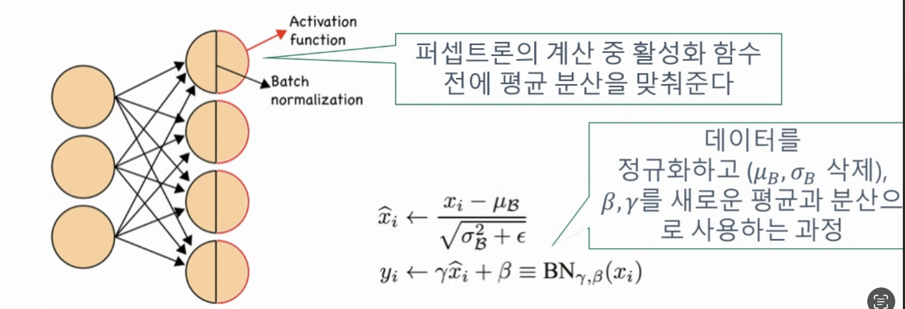

<h1>KAIST SW 교육</h1>

<div align = center>

</div>
<br>

[2022] 전국 고등학생 대상 SW전공 진로탐색 및 교육 (11/12~13일)

<br>

# 11월 12일

### 제 1교시 

 - KAIST 전산학부의 '가치관' (류석영 교수)
  
 
 <h2>Human-Centric-Computing</h2>
<br>

>Computing Science
>
>System and Network
>
>Software Design
>
>Secure Computing
>
>Visual Computing
>
>AI
>
>Social Computing
>
>Interactive Computing


<h2>Q. 컴퓨터 코딩을 배워서 뭘 하나요?</h2>

- 전산학부는 문제를 해결하는 법을 배우는 곳입니다.
<br> (like  CS처럼)
```
문제해결 = 요리
코딩 = 칼질
```
❤️ A. 문제 해결!

* * *

### 제 2교시 
카이스트 자랑.
 - SW 멘토링
 - KAIST 활동 및 진로
 - KAIST에서 살아남기
 - Q&A

### 제 3교시
- 4차 산업혁명 시대의 빅데이터 종류와 활용 사례 (이재길 교수)
 
### 제 4교시
- 빅데이터 실습 (네이버 영화 리뷰 데이터 스크래핑 및 분석 실습)

### 제 5교시
- SW 전공생 특강 (KAIST 전산학부)


* * *
* * *

# 11월 13일

### 1교시

- AI 특강 및 실습

>Graphics AI
>
>Intelligent AI
>
>Vision AI
>
>AI Application
>
>Knowledge AI Recommedation
>
>Knowledge AI Flitering
>
>AI 개발 


### 제 2교시

- 딥러닝 알고리즘
- 인공지능 실습 (소리 분석 앱 만들기)

<h2>딥러닝이란?</h2>

- 여러 비선형 변환기법의 조합을 통해 높은 수준의 추상화를 시도하는 기계학습 알고리즘의 집합
- 비선형 함수를 여러 층 쌓아서 만든 것


```
딥러닝으로 무엇을 할 수 있을? = 우리에게 필요한 함수를 만들어준다.
```
2층 신경망은 중간 층의 노드 개수가 충분할 때, 모든 함수를 근사할 수 있다.


## 합성곱 신경망

- 계층적 특성 추출
- 패턴 인식


<br>


## 풀링(polling)이란?


# CNN 전체 구조


>1,2,3층 합성곱 신경망
>
>스트라이드
>
>풀링

# RNN


## 시계열 기반 문제 해결의 어려움

```
과거 데이터들 간 상대적 중요도 추정

과거 데이터 자체 또는 그들 간의 상관관계를 기억해야 함
```
## 순환 신경망 세포

- FC NN 또는 CNN에서는 현제 스텝의 입력값이 유일한 입력값임
- 반면, RNN의 한 "뉴런"은 현제 스텝의 입력값으로 받음.

### 순환의 의미

>바로 전 스텝의 출력값을 입력으로 받는 다는 것의 의미
>
>>이번 스텝의 연산(예측, 분류 등)을 위해 과거의 데이터를 참조하겠다.
>
>>이번 연산의 결과를 통해 계산된 매개 변수 업데이트 값을 시간축을 따라서도 역전파시키겠다.


# 시계열을 활용하는 예: RNN의 활용


# 순환 신경망 


- 모든 time-step에서 같은 매개 변수를 가지는 같은 함수를 사용한다.
- ht는 기존 신경망의 중간 층 같은 개념
- 다른 점은 시간적으로 앞뒤로 연결이 되어 있다는 것

# 기본적인 순환 신경망(Vanilla RNN)


# 과대적합 극복을 통한 딥러닝의 성능 향상: Dropout and Batch Normalization


# 규제(Regularization)

- 모델의 복잡성은 크게 손해를 보지 않으면서(편향은 거의 무변화), 분산을 많이 줄이는 방법은 없을까?
- 원래 모델을 규제하자: 과하게 복잡한 가을 세우지 않도록



## Review: 앙상블
- 데이터를 여러 개의 학습 세트로 나누어, 동시에 여러 모델을 통한 학습을 진행
- 여러 전문가의 의견을 듣고, 그것을 결합하여 최종 결정을 내리는 방식



- 이를 통해서 과대 적합을 해결


### (1) Dropout: 개념

- 신경망의 일부분을 확률적으로 삭제하여 삭제하고 남은 부분으로 학습
- 학습데이터를 가지고 업데이트마다 노드마다 확률적 삭제를 통하여 수행



### (2) Batch 정규화(Normalization)

 - 평균을 0으로, 분산을 1로 만드는 과정
 - 평균 µ, 분산 σ2를 가지는 확률 변수 x가 있다면
 - 확률 변수 Z = (x-µ)/σ 는 평균 0, 분산 1을 갖게 됨.
 
 

### Batch Nomalization

> 층에 들어오는 평균과 분산을 일치시킴.
>
>>동시에 각 층 간의 상관관계를 학습시키기 위해 일치시키는 평균 및 분산 따로 학습



### Batch Normalization 해석
 - 평균과 분산을 계산하여 모든 층에 주어질 입력 데이터의 분포가 같게 함.
 - 은닉 층의 안정적 학습으로 인한 빠른 학습 가능
 - 은닉 층이 가질 수 있는 값을 한정지어 변화의 폭 줄임 -> 분산 감소(규제!)
 - 내부공변량변화(Internal Convariant Shift)문제 해결로 더 높은 learning rate 사용가능 -> 정규화 과정에서 자동으로 미분값의 크기 조절

# 제 3교시
 - 메타버스의 이해
 
> 연관어 분석 결과, 메타버스는 엔터테인먼트, 교육, 쇼핑 등 현실 전반와 관련되어 있습니다.
> 메타버스를 통해 이미 우리의 일생생활 곳곳에 다양한 형태의 가상형실 세계가 구현되고 있음을 알 수 있습니다.

>메타버스 관련해서 긍정적인 키워드가 상대적으로 많았습니다. 긍정적 키워드는 새로운 기술에 대한 기대감이 많았으며, 
>부정적 키워드는 과몰입에 대한 문제 및 과도한 인기에 대한 우려와 관련되었습니다.

- 가상 현실
- 증강 현실
- 혼합 현실
- 확장 현실

## 메타버스 활용 사례

- 가상 현실 편의점 'cu 제페토 한강점'
- 아바타의 모슴으로 수료식에 참가한 LG전자 직원들
- DGC 금융 지우 경영진 회의 진행
- 하나 은행 연수원 하나글로벌 캠퍼스 오픈 행사
- 가평 설악 고등학교(재페토 플랫폼에 교실, 도서실 등 구현)-> 동아리, 독서 토론 등에 활용
- 국립 중앙 도서관 도서 관장 메타버스 워크숍 개최
- 상점시 중원 도서관 '한 도서관 한 책 읽기' 시만 참여 행사 개최
- KBS 개표 방송
- 제주, 성산일출봉 등 체험 가능

## 메타버스 플랫폼

- 로블록스
- 이프렌드
- 제페토
- 게더타운

# 제 4교시
 - 메타버스 실습(이프렌드)
 
 
 
